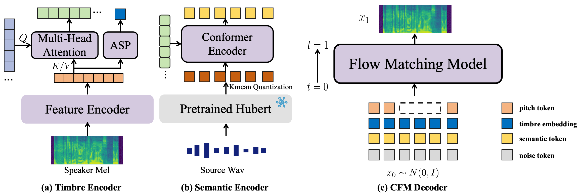

## Overview

This paper introduces PFlow-VC, a conditional flow matching voice conversion model that leverages fine-grained discrete pitch tokens and target speaker prompt information for expressive voice conversion (VC). Previous VC works primarily focus on speaker conversion, with further exploration needed in enhancing expressiveness (such as prosody and emotion) for timbre conversion. Unlike previous methods, we adopt a simple and efficient approach to enhance the style expressiveness of voice conversion models. Specifically, we pretrain a self-supervised pitch VQVAE model to discretize speaker-irrelevant pitch information and leverage a masked pitch-conditioned flow matching model for Mel-spectrogram synthesis, which provides in-context pitch modeling capabilities for the speaker conversion model, effectively improving the voice style transfer capacity. Additionally, we improve timbre similarity by combining global timbre embeddings with time-varying timbre tokens. Experiments on unseen LibriTTS test-clean and emotional speech dataset ESD show the superiority of the PFlow-VC model in both timbre conversion and style transfer.

## Model Architecture
<table>
    <tr>
        <td >
 
</td>
    </tr>
</table>

Figure.1 The overall architecture of PFlow-VC.

&nbsp;
 

# Zero-Shot VC Results

<table>
    <tr>
        <th> Transcript</th>
        <th>Source Speech</th>
        <th> Target Speech</th>
        <th> Your-TTS</th>
        <th> Diff-HierVC</th>
      	<th> SEF-VC</th>
      	<th> PFlow-VC</th>
    </tr>
    <tr>
        <th> lady larkspur starts suddenly and turns towards</th>
        <th> <audio controls id="player" onplay="pauseOthers(this);"><source src="assets/audios/zero_shot/1/src.wav" type="audio/mpeg"></audio> </th>
        <th> <audio controls id="player" onplay="pauseOthers(this);"><source src="assets/audios/zero_shot/1/ref.wav" type="audio/mpeg"></audio> </th>
        <th> <audio controls id="player" onplay="pauseOthers(this);"><source src="assets/audios/zero_shot/1/yourtts.wav" type="audio/mpeg"></audio> </th>
        <th> <audio controls id="player" onplay="pauseOthers(this);"><source src="assets/audios/zero_shot/1/diff.wav" type="audio/mpeg"></audio> </th>
        <th> <audio controls id="player" onplay="pauseOthers(this);"><source src="assets/audios/zero_shot/1/sefvc.wav" type="audio/mpeg"></audio> </th>
        <th> <audio controls id="player" onplay="pauseOthers(this);"><source src="assets/audios/zero_shot/1/cfmvc.wav" type="audio/mpeg"></audio> </th>
    </tr>	
  	<tr>
        <th> you may be quite sure it's there said captain battleax and that i can so use it as to half obliterate your town within two minutes of my return on board</th>
        <th> <audio controls id="player" onplay="pauseOthers(this);"><source src="assets/audios/zero_shot/2/src.wav" type="audio/mpeg"></audio> </th>
        <th> <audio controls id="player" onplay="pauseOthers(this);"><source src="assets/audios/zero_shot/2/ref.wav" type="audio/mpeg"></audio> </th>
        <th> <audio controls id="player" onplay="pauseOthers(this);"><source src="assets/audios/zero_shot/2/yourtts.wav" type="audio/mpeg"></audio> </th>
        <th> <audio controls id="player" onplay="pauseOthers(this);"><source src="assets/audios/zero_shot/2/diff.wav" type="audio/mpeg"></audio> </th>
        <th> <audio controls id="player" onplay="pauseOthers(this);"><source src="assets/audios/zero_shot/2/sefvc.wav" type="audio/mpeg"></audio> </th>
        <th> <audio controls id="player" onplay="pauseOthers(this);"><source src="assets/audios/zero_shot/2/cfmvc.wav" type="audio/mpeg"></audio> </th>
    </tr>	
  	<tr>
        <th> he shall not leave you day or night whether you are working or playing or sleeping</th>
        <th> <audio controls id="player" onplay="pauseOthers(this);"><source src="assets/audios/zero_shot/3/src.wav" type="audio/mpeg"></audio> </th>
        <th> <audio controls id="player" onplay="pauseOthers(this);"><source src="assets/audios/zero_shot/3/ref.wav" type="audio/mpeg"></audio> </th>
        <th> <audio controls id="player" onplay="pauseOthers(this);"><source src="assets/audios/zero_shot/3/yourtts.wav" type="audio/mpeg"></audio> </th>
        <th> <audio controls id="player" onplay="pauseOthers(this);"><source src="assets/audios/zero_shot/3/diff.wav" type="audio/mpeg"></audio> </th>
        <th> <audio controls id="player" onplay="pauseOthers(this);"><source src="assets/audios/zero_shot/3/sefvc.wav" type="audio/mpeg"></audio> </th>
        <th> <audio controls id="player" onplay="pauseOthers(this);"><source src="assets/audios/zero_shot/3/cfmvc.wav" type="audio/mpeg"></audio> </th>
    </tr>	
  	<tr>
        <th> she wanted a glance of the new books and periodicals and talk of great philanthropies and reforms</th>
        <th> <audio controls id="player" onplay="pauseOthers(this);"><source src="assets/audios/zero_shot/4/src.wav" type="audio/mpeg"></audio> </th>
        <th> <audio controls id="player" onplay="pauseOthers(this);"><source src="assets/audios/zero_shot/4/ref.wav" type="audio/mpeg"></audio> </th>
        <th> <audio controls id="player" onplay="pauseOthers(this);"><source src="assets/audios/zero_shot/4/yourtts.wav" type="audio/mpeg"></audio> </th>
        <th> <audio controls id="player" onplay="pauseOthers(this);"><source src="assets/audios/zero_shot/4/diff.wav" type="audio/mpeg"></audio> </th>
        <th> <audio controls id="player" onplay="pauseOthers(this);"><source src="assets/audios/zero_shot/4/sefvc.wav" type="audio/mpeg"></audio> </th>
        <th> <audio controls id="player" onplay="pauseOthers(this);"><source src="assets/audios/zero_shot/4/cfmvc.wav" type="audio/mpeg"></audio> </th>
    </tr>
  	<tr>
        <th> in the present day we are well aware that an ancient philosopher is to be interpreted from himself and by the contemporary history of thought</th>
        <th> <audio controls id="player" onplay="pauseOthers(this);"><source src="assets/audios/zero_shot/5/src.wav" type="audio/mpeg"></audio> </th>
        <th> <audio controls id="player" onplay="pauseOthers(this);"><source src="assets/audios/zero_shot/5/ref.wav" type="audio/mpeg"></audio> </th>
        <th> <audio controls id="player" onplay="pauseOthers(this);"><source src="assets/audios/zero_shot/5/yourtts.wav" type="audio/mpeg"></audio> </th>
        <th> <audio controls id="player" onplay="pauseOthers(this);"><source src="assets/audios/zero_shot/5/diff.wav" type="audio/mpeg"></audio> </th>
        <th> <audio controls id="player" onplay="pauseOthers(this);"><source src="assets/audios/zero_shot/5/sefvc.wav" type="audio/mpeg"></audio> </th>
        <th> <audio controls id="player" onplay="pauseOthers(this);"><source src="assets/audios/zero_shot/5/cfmvc.wav" type="audio/mpeg"></audio> </th>
    </tr>
</table>
